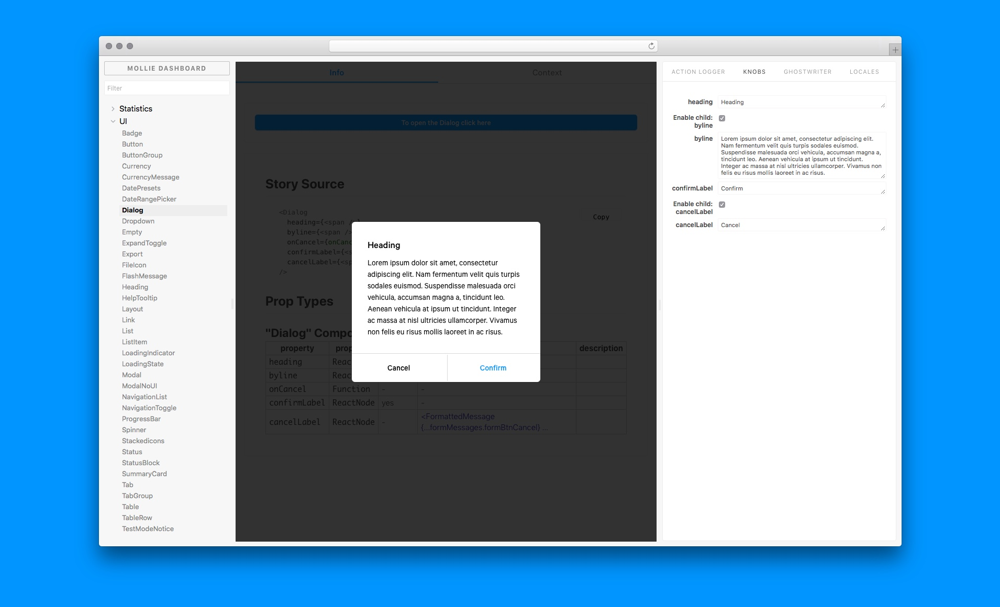

<h1 align="center">Storybook Addon Ghostwriter</h1>



## Motivation

Storybook Addon Ghostwriter allows you to write your Storybook stories faster. Your codebase changes continuously and you don't want to update your Storybook stories every time your components change. Ghostwriter extracts your components’ `PropTypes` / `Flow types` and allows you to edit React props dynamically using the Storybook UI. Your components get documented automatically by providing a static overview of the available props. Ghostwriter generates code snippets for both your component and your Storybook stories, allowing you to ship new components faster.

### Advantages

- Write Storybook stories faster
- Less maintenance
- Dynamic component prop generation
- Works with High Order Components
- Component documentation

## Installation

Please make sure you have the following peer dependencies installed:

- `babel-plugin-react-docgen`
- `@storybook/addon-actions`
- `@storybook/addon-info`
- `@storybook/addon-knobs`
- `@storybook/addons`
- `lodash`
- `react`

Add Ghostwriter and its peer dependencies as a `devDependency` to your project using NPM:

```bash
npm install --save-dev storybook-addon-ghostwriter
# Install peer dependencies
npm install --save-dev babel-plugin-react-docgen @storybook/addon-actions @storybook/addon-info @storybook/addon-info @storybook/addons lodash @storybook/addon-knobs
```

Or, if you prefer Yarn:

```bash
yarn add --dev storybook-addon-ghostwriter
# Install peer dependencies
yarn add --dev babel-plugin-react-docgen @storybook/addon-actions @storybook/addon-info @storybook/addon-info @storybook/addons lodash @storybook/addon-knobs
```

Add the following line to your `.babelrc` file:

```json
{
  "plugins": [
    [
      "react-docgen",
      {
        "resolver": "findAllComponentDefinitions"
      }
    ]
  ]
}
```

Configure Ghostwriter as an addon by adding it to `addons.js` file (located in the Storybook config directory):

```js
// .storybook/addons.js
import 'storybook-addon-ghostwriter/register';
```

## Writing stories

Now, write your stories with Ghostwriter.

```js
import React from 'react';
import { storiesOf } from '@storybook/react';

// Story components
import ghostwriter from 'storybook-addon-ghostwriter';

// This is an example component.
import PropTypes from 'prop-types';

export default class ExampleComponent extends React.Component {
  render() {
    const { className, propName, children } = this.props;
    return (
      <div className={className}>
        <strong>{propName}</strong> {children}
      </div>
    );
  }
}

ExampleComponent.propTypes = {
  className: PropTypes.string,
  propName: PropTypes.string.isRequired,
  children: PropTypes.element,
};

/**
 * Overwrite the default props This could be a knob form the knob addon.
 * see https://github.com/storybooks/storybook/tree/master/addons/knobs
 * It has to be function otherwise overwriting knobs won't work properly
 * e.g. prop: text('knob text', 'knob'),
 */
const getDefaultProps = () => ({ className: 'overwrite' });
const markdown = `# Markdown example`;

storiesOf('components', module)
  .addDecorator(
    ghostwriter({
      // Notice that we dont use angle brackets; '<' and '>'
      component: ExampleComponent,
      // This overwrites the knobs by docs
      componentProps: getDefaultProps,
      // Extra info in markdown
      markdown: markdown,
      /**
       * Sometimes there is a need for additionalContext.
       * This could be the case whenever a component needs an action from outside the prop scope.
       * For example a Modal that waits for a ref to be called.
       * <button onClick={()=> this.modalRef.open}>Open</button>
       * Then additionalContext is the perfect place. Most of the time you won't need it though
       * because knobs will be your friend.
       */
      additionalContext: <span>This is JSX</span>,
    }),
  )
  .add('ExampleComponent', () => {
    return (
      <div>
        <p>Put your component in context. Like:</p>
        <p>this is a component in the wild!</p>
        <div
          style={{
            border: '2px solid #000',
            padding: '40px',
            borderRadius: '4px',
            textAlign: 'center',
          }}>
          <ExampleComponent className="some-class-name" propName="make some context">
            Wow context
          </ExampleComponent>
        </div>
      </div>
    );
  });
```

## Snippet for VSCode, Atom and Sublime-text

One of the goals of Ghostwriter is that it tries to optimize your SWT™️ (story write time). Therefore a snippet in your editor could help you out a lot. We made one for you with the fantastic snippet-generator by Pawel Grzybek. So if you use Atom, Sublime-text or VSCode be sure to [check out the snippet](https://snippet-generator.app/?description=storybook-ghostwriter&tabtrigger=ghostwriter&snippet=import+React+from+%27react%27%3B%0Aimport+%7B+storiesOf+%7D+from+%27%40storybook%2Freact%27%3B%0A%0A%2F%2F+Story+components%0Aimport+ghostwriter+from+%27storybook-addon-ghostwriter%27%3B%0A%0A%2F%2F+import+the+component.%0Aimport+%241+from+%27.%2Findex%27%3B%0A%0A%2F%2F+Overwrite+of+default+props+This+could+be+a+knob+form+the+knob+addon%0Aconst+getDefaultProps+%3D+%28%29+%3D%3E+%28%7B%242%7D%29%3B%0Aconst+markdown+%3D+%60%243%60%3B%0A%0AstoriesOf%28%27components%27%2C+module%29%0A++.addDecorator%28%0A++++ghostwriter%28%7B%0A++++++component%3A+%241%2C%0A++++++componentProps%3A+getDefaultProps%2C%0A++++++markdown%3A+markdown%2C%0A++++++%2F%2F+additionalContext%3A+%3Cspan%3Eadditional+content%3C%2Fspan%3E%2C%0A++++%7D%29%2C%0A++%29%0A++.add%28%27%241%27%2C+%28%29+%3D%3E+%7B%0A++++return+%28%0A++++++%3C%241+%2F%3E%0A++++%29%3B%0A++%7D%29%3B&mode=vscode)

## Contributing

Want to help us make Storybook Addon Ghostwriter better? We take [pull requests](https://github.com/mollie/storybook-addon-ghostwriter/pulls).

## Working at Mollie

Mollie is always looking for new talent to join our teams. We’re looking for inquisitive minds with good ideas and strong opinions, and, most importantly, who know how to ship great products. Want to join the future of payments? [Check out our vacancies](https://jobs.mollie.com).

## License

[New BSD (Berkeley Software Distribution) License](https://opensource.org/licenses/BSD-3-Clause). Copyright 2013-2018, Mollie B.V.
